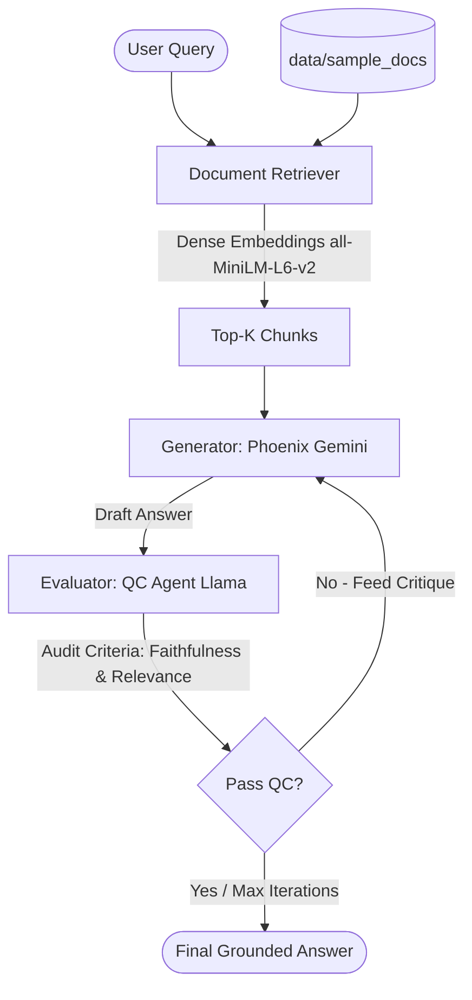

# Orchnex: Gemini-Llama Dual-LLM Orchestration & Grounded Intelligence Engine

<p align="center">
  
</p>

## Overview

**Orchnex** is an end-to-end, dual-LLM orchestration platform and grounded intelligence engine engineered to transform brief, ambiguous user queries into execution-ready specifications, eliminate AI hallucinations, and deliver verifiable, 10x-quality outputs.

By pairing local lightweight models (**Qwen / Llama 3 via Ollama**) with frontier foundation models (**Google Gemini / Phoenix**), Orchnex implements a closed-loop multi-stage pipeline:

1. **Workspace Context Scanning**: Automatically scans local workspace dependencies (`package.json`, `tsconfig.json`, tech stacks) to ground prompts in real project architectures.
2. **PromptMaster 4.0 Optimization**: Employs two-phase XML reasoning (`<analysis>` ➔ `<enhanced_prompt>`) that auto-assigns authoritative personas, resolves ambiguities, and outputs strict role/task/constraint specs.
3. **Automated Quality Validation Gate (`validator.py`)**: Enforces structural validity and prevents unfilled placeholder leaks (`[Platform]`, `TODO`) through an auto-retry correction loop before downstream execution.
4. **Dual Generation Engine with Side-by-Side Comparison**: Generates both standard raw outputs and PromptMaster-enhanced outputs in parallel with 1-click clipboard actions.
5. **Evaluation-Driven RAG & NLI Hallucination Detection**: Evaluates factual consistency using local dense embeddings (`all-MiniLM-L6-v2`) and performs per-claim Natural Language Inference (NLI) with strict `SUPPORTED`, `CONTRADICTED`, and `NEUTRAL` verification tags.
6. **Production-Grade Next.js Interface**: Features real-time percentage progress tracking (0–100%), stage indicators, request abort/stop controls, and an Apple-inspired monochrome aesthetic.

### Orchnex in Action

|System Initialization|Enhanced Prompt|
|--|--|
|Inital Response|Meta Feedback-1|
|Refined Response-1|Meta Feedback-2|
|Refined Response-2|Final Result|

---

## 🤖 Models & AI Architecture Stack

Orchnex combines distinct local and cloud AI models tailored for specialized pipeline stages:

| Pipeline Stage | Model Used | Provider / Mechanism | Purpose |
| :--- | :--- | :--- | :--- |
| **Prompt Enhancement** | `PromptMaster 4.0` (`qwen3:1.7b` / `llama3`) | Local Ollama Provider | 2-Phase XML reasoning (`<analysis>` + `<enhanced_prompt>`). Assigns senior expert personas & specs. |
| **Execution Engine** | `Phoenix` (Google Gemini 1.5 Flash / Gemini Pro) | Google AI Studio SDK | Executes PromptMaster's structured spec to generate high-signal deliverables. |
| **Baseline Generation** | `Raw Gemini` | Google AI Studio SDK | Generates direct raw answers to provide side-by-side quality comparison against PromptMaster. |
| **Quality Control Gate** | `Llama-3.1-8b-Instruct` / `Llama3` | NVIDIA NIM / Local Ollama | Evaluates generated drafts for Faithfulness and Relevance before user delivery. |
| **Hallucination Detection** | `NLI Claim Evaluator` (`qwen3:1.7b` / `llama3`) | `hallucination_detector.py` | Extracts atomic claims and performs Natural Language Inference (`SUPPORTED`, `CONTRADICTED`, `NEUTRAL`). |
| **Vector Embeddings** | `all-MiniLM-L6-v2` | HuggingFace Transformers & PyTorch | Local dense vector embedding generation for semantic document chunk search. |

---

## 🏗️ System Architecture & Data Flow

#### System Architecture & Flow


### RAG Evaluator Flow


---

## ✨ Key Features

- 🤖 **PromptMaster 4.0 Reasoning Engine**:
  - Two-phase XML reasoning process: `<analysis>` scratchpad followed by `<enhanced_prompt>` execution spec.
  - Dynamically assigns authoritative personas (e.g. *"Staff Backend Engineer specializing in distributed systems"*).
- 🛡️ **Automated Quality Gating (`validator.py`)**:
  - Rejects unfilled template placeholders (`[Platform]`, `TODO`), generic personas, or unparsed XML tags with an automated retry loop.
- 📁 **Project Context Scanner (`context_scanner.py`)**:
  - Automatically scans workspace `package.json`, TypeScript configs, and directory structures to inject project context into PromptMaster.
- 🔍 **RAG Orchestrator**:
  - **Local Semantic Search**: Generates dense vector embeddings using `all-MiniLM-L6-v2` via PyTorch and HuggingFace `transformers`.
  - **Document Indexing**: Automatically parses, splits (overlapping sliding-window), and embeds `.md` and `.txt` documents placed in `data/sample_docs/`.
- 🛡️ **Hallucination Detection & Claim NLI (`hallucination_detector.py`)**:
  - Deconstructs generated answers into atomic claims and verifies them against retrieved document context using Natural Language Inference (NLI):
    - `SUPPORTED`: Empirical match with document context.
    - `CONTRADICTED`: Conflicts with document context.
    - `NEUTRAL`: Unsubstantiated claim.
- ⚡ **Side-by-Side Prompt Comparison UI**:
  - Renders raw prompt output vs. PromptMaster 4.0 enhanced output side-by-side with 1-click **Copy Buttons** (`📋 Copy` ➔ `✓ Copied`).
- 🛑 **Interactive Request Controls**:
  - Real-time percentage progress bar (0-100%) and instant request cancellation **Stop Button (⏹️)** backed by `AbortController`.
- 🦙 **Local Ollama & Offline Support**: Run both the standard Multi-LLM Orchestrator and the RAG Evaluator completely offline using models hosted on Ollama (`qwen3:1.7b` or `llama3`).

---

## 🚀 Quick Start Guide

### 1. Requirements 
- Python >= 3.8
- Node.js >= 18
- PyTorch & HuggingFace Transformers
- Google AI Python SDK (`google-generativeai`)
- OpenAI Python SDK (`openai` - for Nvidia NIM API)
- Ollama (for local offline models)

### 2. API Key Setup
Configure your keys in the `.env` file:

#### Gemini API (Google AI Studio)
1. Go to [Google AI Studio](https://aistudio.google.com/app/apikey).
2. Create an API Key and set `GEMINI_API_KEY` in `.env`.

#### Llama API via NVIDIA NIM
1. Go to [NVIDIA Build](https://build.nvidia.com/meta/llama-3_1-8b-instruct).
2. Generate an API Key and set `NVIDIA_API_KEY` in `.env`.

---

### 3. Running Application

Launch the full-stack web application (FastAPI backend + Next.js frontend) with a single command:

```bash
./start.sh
```

- **Frontend Web UI**: `http://localhost:3000`
- **Backend API**: `http://localhost:8000`

#### CLI Modes:
- **Standard CLI mode**:
  ```bash
  orchnex
  ```
- **Local offline mode using Ollama**:
  ```bash
  orchnex --ollama --prompt "Explain quantum computing"
  ```
- **Local offline RAG mode**:
  ```bash
  orchnex-rag --ollama --query "How does Orchnex work?"
  ```

---

## 💻 Programmatic Usage Example

Here is how you can initialize the RAG Orchestrator programmatically:

```python
from orchnex import RAGOrchestrator, LLMConfig

# Configuration
config = LLMConfig(
    gemini_api_key="your_gemini_key",
    nvidia_api_key="your_nvidia_key",
    use_ollama=False
)

# Initialize Orchestrator
orchestrator = RAGOrchestrator(config)

# Index your reference documents directory
orchestrator.load_documents("data/sample_docs")

# Process query with iterative evaluation
summary = orchestrator.process_query("What is the architecture of Orchnex?")
print("QC Passed:", summary["qc_passed"])
print("Final Answer:\n", summary["final_answer"])
```

---

## Documentation

Visit our [documentation](https://orchnex.readthedocs.io) for setup guides, API references, and performance guidelines.
