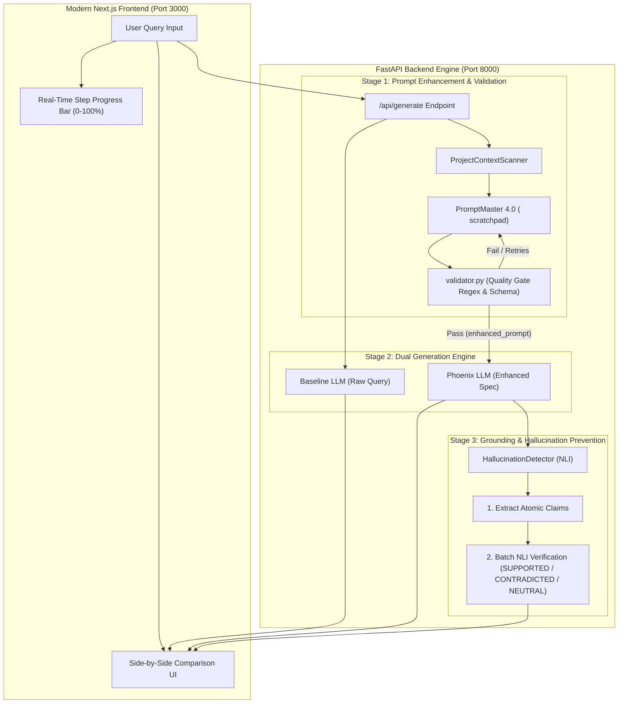

# 🌌 Orchnex — Dual-LLM Orchestration & Grounded Intelligence Engine

Orchnex is a full-stack dual-LLM orchestration platform designed to eliminate hallucinations, enforce prompt precision, and provide real-time side-by-side prompt output comparisons.

---

## 🏗️ System Architecture & Data Flow



---

## ✨ Key Features

1. **PromptMaster 4.0 Reasoning Engine**:
   - Executes a two-phase XML reasoning process: `<analysis>` scratchpad followed by `<enhanced_prompt>` execution spec.
   - Dynamically assigns authoritative personas (e.g. *"Staff Backend Engineer specializing in distributed systems"*).

2. **Automated Quality Gating (`validator.py`)**:
   - Rejects unfilled template placeholders (`[Platform]`, `TODO`), generic personas, or unparsed XML tags with an automated retry loop.

3. **Project Context Scanner (`context_scanner.py`)**:
   - Automatically scans workspace `package.json`, TypeScript configs, and project structure to inject context into the prompt enhancer.

4. **Hallucination Detection & Claim NLI (`hallucination_detector.py`)**:
   - Deconstructs generated answers into atomic claims and verifies them against retrieved document context using Natural Language Inference (NLI):
     - `SUPPORTED`: Empirical match with document context.
     - `CONTRADICTED`: Conflicts with document context.
     - `NEUTRAL`: Unsubstantiated claim.

5. **Side-by-Side Prompt Comparison**:
   - Renders raw prompt generation vs. PromptMaster enhanced generation side-by-side with 1-click **Copy Buttons** for comparison.

6. **Monochrome Apple Siri Visual Design**:
   - Dark aesthetic with real-time percentage progress bar, step indicators, and animated WebGL background.

---

## 🚀 Quick Start

### 1. Prerequisites
- **Python 3.10+**
- **Node.js 18+**
- **Ollama** running locally (`ollama serve` with `qwen3:1.7b` or `llama3`)

### 2. Run Application
Launch both backend FastAPI server and Next.js frontend with a single command:
```bash
./start.sh
```

- **Frontend UI**: `http://localhost:3000`
- **Backend API**: `http://localhost:8000`

---

## 🛠️ Tech Stack

- **Frontend**: Next.js 15 (App Router), Tailwind CSS, React Markdown, WebGL OGL.
- **Backend**: FastAPI, PyDantic, Rich Console Logger.
- **AI Orchestration**: Llama 3 / Qwen 3 (via Ollama local provider), Gemini / Phoenix API.
